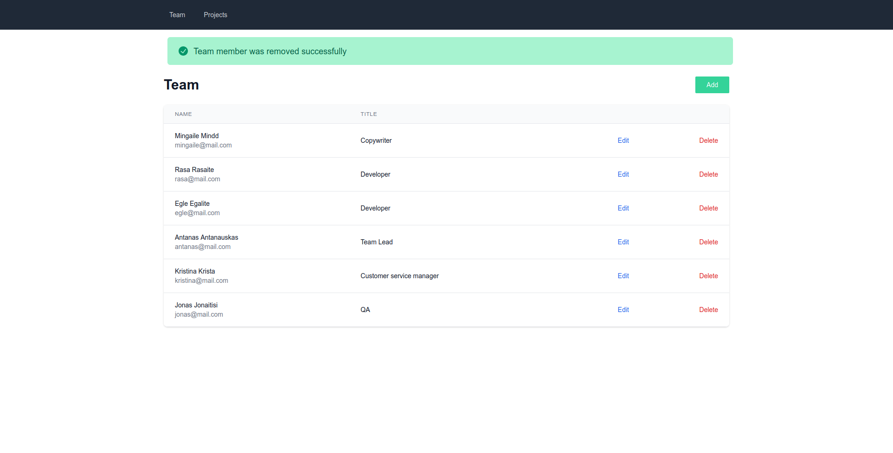

# BIT sprint 2: CRUD Application

Plain PHP CRUD application without using frameworks

## Functionality

- :heavy_check_mark: use mysql
- :heavy_check_mark: can add employee
- :heavy_check_mark: can edit employee details
- :heavy_check_mark: can delete employee
- :heavy_check_mark: can add project
- :heavy_check_mark: can edit project
- :heavy_check_mark: can remove project
- :heavy_check_mark: can assign employee to project
- :heavy_check_mark: project can have multiple employees
- :heavy_check_mark: remove employee from project
- :heavy_check_mark: list projects
- :heavy_check_mark: list employess

## Installation

:heavy_exclamation_mark: **NOTE DOCKER USE**

Docker is used for mysql container. To use docker-compose create mysql folder in projects root directory and then run docker-compose;

* Using local php environment
```bash

    # clone repository
    git clone git@github.com:EvaldasBurlingis/bit-sprint2-crud.git

    # change directory
    cd bit-sprint-2-crud

    # add your database credentials(host, username, password) to config/database.php

    # if using local php server run
    php -S localhost:8000

    # go to
    localhost:8000/install.php
```

* Using server
```bash

    # clone to your serve
    git clone git@github.com:EvaldasBurlingis/bit-sprint2-crud.git

    # change directory
    cd bit-sprint-2-crud

    # add your database credentials(host, username, password) to config/database.php

    # go to
    your-server-address/install.php
```

## Screenshots

<div>
    
    
    
    
    
    
    
</div>